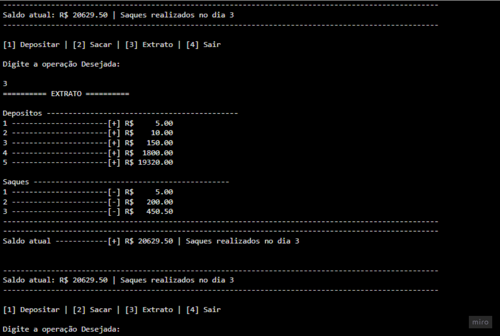

# Projeto Conta Bancária - Desafio Desafio

## 🚀 Sobre o projeto
Simulação de funcionalidades basicas das operações de deposito e saque e demonstração de um extrato das transações na tela.

## 🎞 Demonstração

## Atualizações

 - Separação do codigo em funções como:
    - data_hora_atual
    - efetuar_deposito
    - efetuar_saque
 - cálculo de transações diarias baseadas em datas 